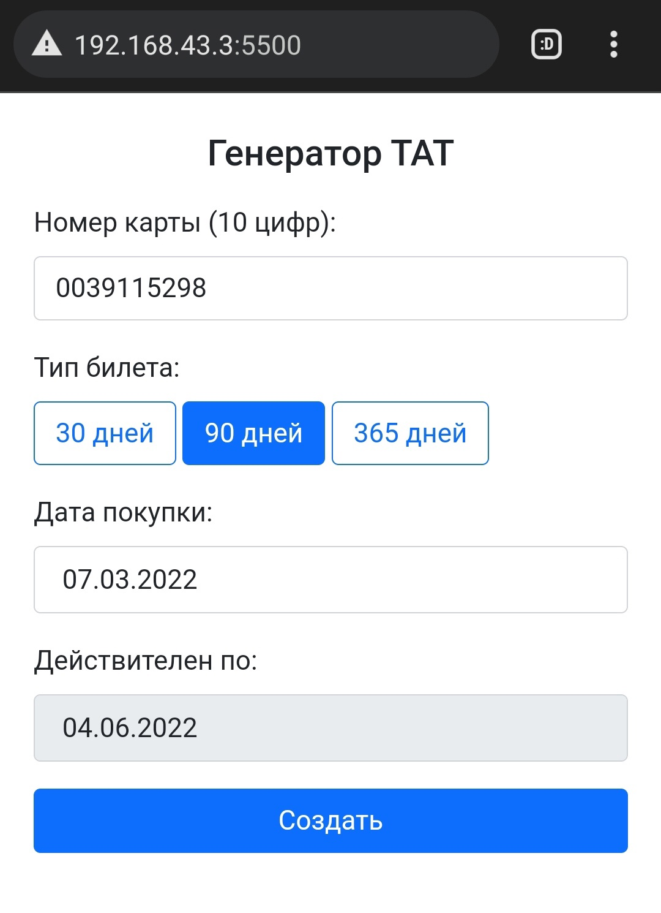
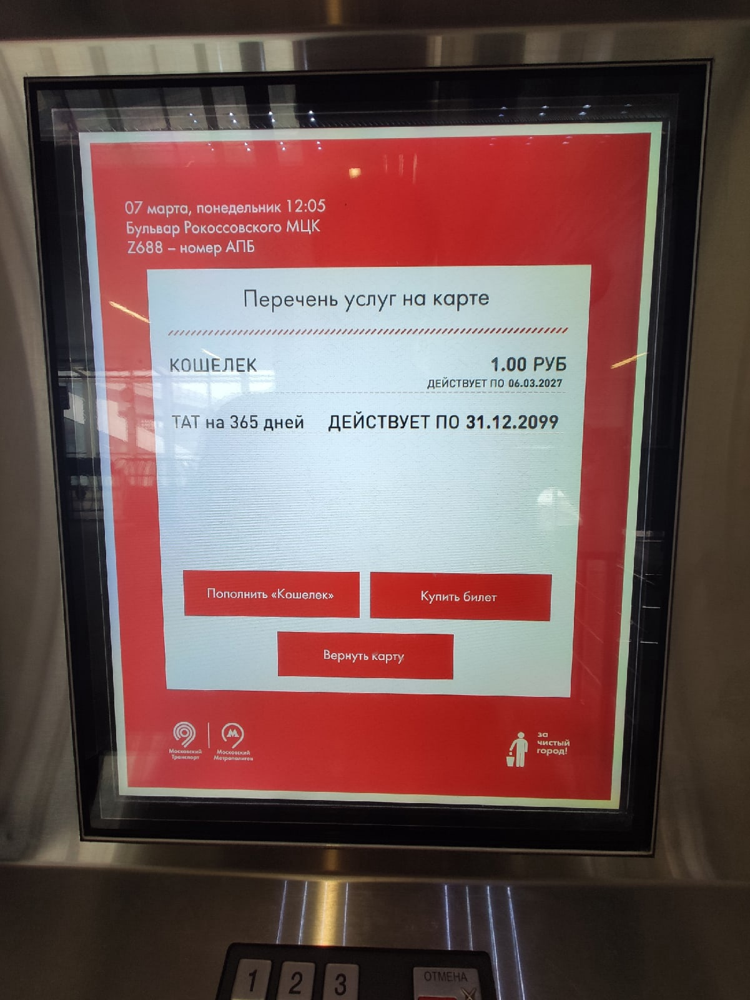
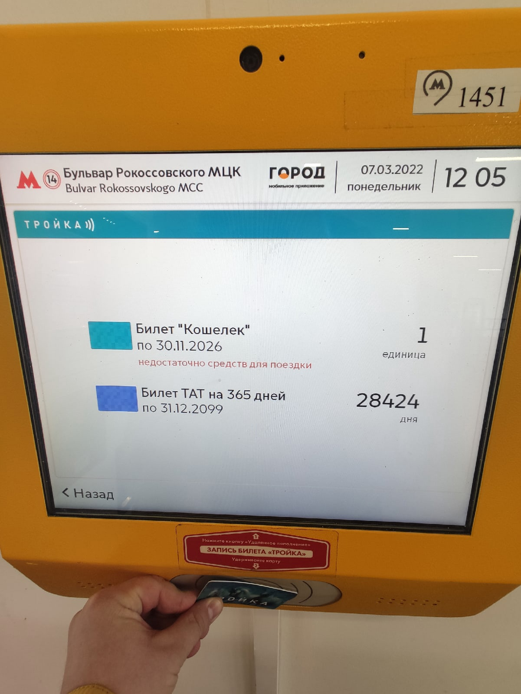
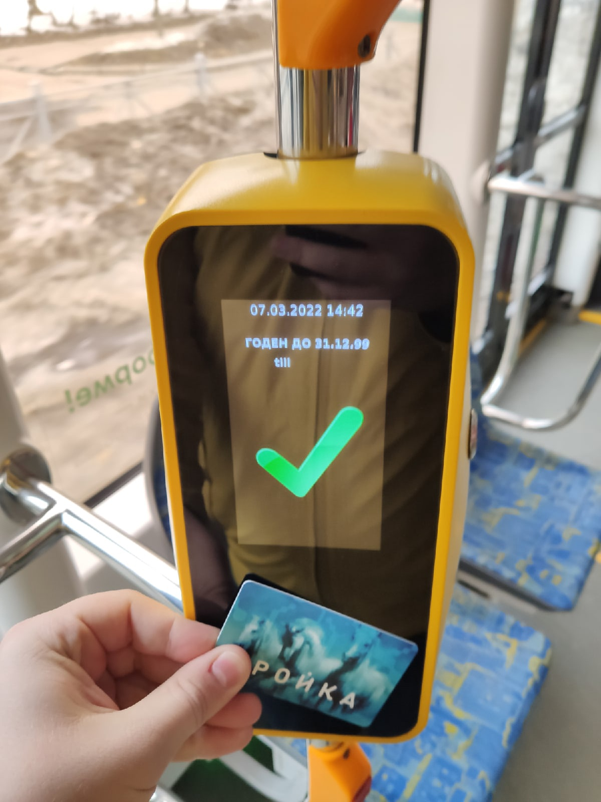

# Инструмент генерации проездного для наземного транспорта Москвы

Позволяет сгенерировать безлимитный билет ТАТ (трамвай, автобус, троллейбус) для карты Тройка на 30, 90 или 365 дней с любыми датами начала и конца действия.

## Генерация билета

Для записи проездного билета на карту необходим только смартфон с NFC. После записи остается возможность использовать карту в метро и покупать на нее другие билеты или пополнять баланс.

## Использование

Сгенерированные билеты ничем не отличаются от купленных в кассе, проходят проверку на любых терминалах и киосках, в приложениях для смартфонов, а также проверяющих устройствах контроллеров.

В реальности не рекомендуется устанавливать такие нереальные даты, так как при проверке билета однозначно возникнут вопросы.

## Купить

После покупки вы получаете все необходимые программы, а также подробную инструкцию по созданию и советы по использованию билетов.

:moneybag: Цена: $200

Контакты: <a href="https://t.me/dedol">Telegram</a>
